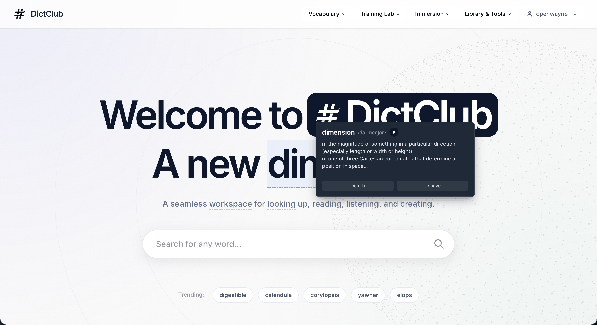
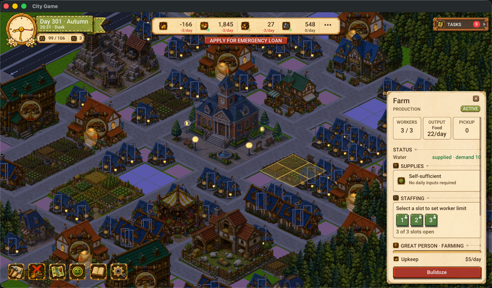

<div align="center">
  
# ⚡ BING (WAYNE) WANG
### `Senior_Software_Architect` | `Full-Stack_Platform` | `AI_Engineering`

<p align="center">
  
</p>

[](https://linkedin.com/in/justbing)
[](mailto:openwayne@gmail.com)


</div>

---

## 👨‍💻 `cat profile.json`
```json
{
  "name": "Bing Wang",
  "alias": "Wayne",
  "location": "Berlin, Germany (Open to relocation)",
  "status": "Available immediately",
  "experience": "15+ Years (10 years at Alibaba & Ant Group)",
  "domains": [
    "High-Availability Platforms (99.999%)", 
    "AI & RAG Pipelines over Unstructured Data", 
    "Game Engine & Open-Source Development"
  ]
}
```

## 🛠 `ls -la /skills/`
| Layer | Technologies |
|:---|:---|
| **Frontend** |    |
| **Backend** |      |
| **AI & Data** |     `LiteLLM` `RAG Pipelines` |
| **Infra & Cloud** |     |

---

## 🚀 `ps aux | grep personal_projects`

### 📚 [DictClub](https://dictclub.com)
> **A smart vocabulary learning platform that bridges reading and acquisition.**
- 🏗 **Architecture**: React (SSR & SEO Optimization) + MariaDB + Multi-source Data Cleaning Pipeline + Chrome Extension Worker
- 💡 **Highlight**: Indexed 200k+ dictionary entries with contextual word-sense resolution. Features spaced-repetition scheduling and adaptive item selection.

<a href="https://dictclub.com" target="_blank">
  
</a>

### 🎮 [Miora]
> **High-performance MMO city-building simulation engine pushing the boundaries of deterministic sync and zero-GC optimization.**
- 🏗 **Architecture**: Highly decoupled Skynet (Server) and SDL3/C++17 (Client) architecture, driven by LuaJIT. Utilizes KCP (Reliable UDP) + Sproto for ultra-low latency, paired with a robust client Jitter Buffer.
- ⚡ **Synchronization**: Hybrid Lockstep & State-Sync model via a shared Server-Authoritative ECS. Enforces strict mathematical determinism across identical Lua ECS pure functions. Features 60-frame state checksums with seamless `dirty_entities` delta resync and Optimistic UI prediction.
- 🚀 **Performance**: Zero-GC optimization at the architectural level. Employs in-place table modifications across the C++/Lua sol2 boundary and Lua FFI C-level pointer offsets for network decoding. Algorithmic bottlenecks strictly constrained (e.g., O(logN) QuadTrees), all while supporting instant Lua hot-reloading.




